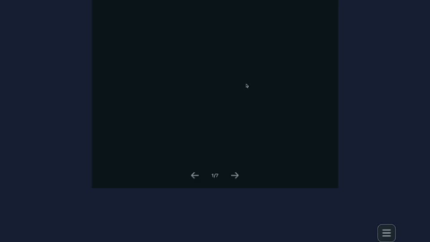

[CS Refresh](https://cs-refresh.herokuapp.com)

This is a flashcard web app, built with react and node.

Here's a [recorded demo](https://www.youtube.com/watch?v=nuvaG-IUBWo) of the site.

Users select which computer science topics to review. 

And then cycle through the cards with touch gestures. 

There are five gestures:
<ol>
<li>swipe card right: go back to the previous card in the deck</li>
<li>swipe card left: go to the next card in the deck</li>
<li>swipe card up: remove the card from the deck</li>
<li>swipe card down: shuffle cards</li>
<li>and tap card: flip card to see front or back.</li>
</ol>

The site uses [react-use-gesture](https://www.npmjs.com/package/react-use-gesture) and [react-spring](https://www.react-spring.io) for the animations and interactivity.

[https://cs-refresh.herokuapp.com](https://cs-refresh.herokuapp.com)
The app is currently:

